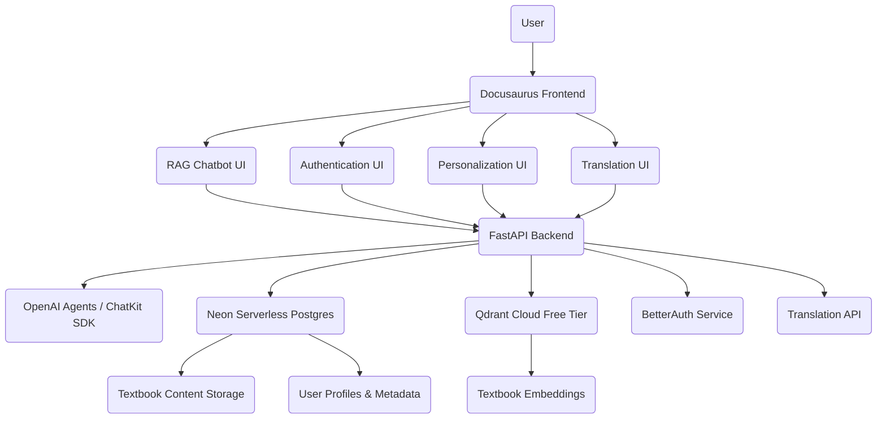

# Unified AI-Native Textbook Project Specification

This document outlines the comprehensive specification for the "Physical AI & Humanoid Robotics" AI-native textbook project, incorporating Docusaurus, Claude Code, Spec-Kit Plus, and an integrated Retrieval-Augmented Generation (RAG) chatbot.

## 1. Project Overview
### 1.1. Goals
- Create an interactive, AI-native textbook on *Physical AI & Humanoid Robotics*.
- Integrate advanced AI features: RAG chatbot, personalization, and translation.
- Utilize modern web technologies (Docusaurus) and AI development tools (Claude Code, Spec-Kit Plus).
- Achieve high hackathon scoring through innovative features and robust implementation.

### 1.2. Scope
- **In Scope:**
    - Development of Docusaurus-based textbook website.
    - Content generation for "Physical AI & Humanoid Robotics" modules.
    - Implementation of an integrated RAG chatbot (OpenAI Agents/ChatKit SDK, FastAPI, Neon, Qdrant).
    - User authentication with BetterAuth and background questions.
    - Chapter personalization feature.
    - Urdu translation functionality.
    - Integration of Claude Code Subagents & Agent Skills for reusable intelligence.
    - Deployment on GitHub Pages or Vercel.
    - Creation of a public GitHub repository.
    - Production of a 90-second demo video.
    - WhatsApp invitation system (conceptual outline).
- **Out of Scope:**
    - Full-fledged user management beyond BetterAuth integration.
    - Advanced content authoring tools within Docusaurus beyond standard markdown.
    - Monetization or subscription models.
    - Real-time collaboration features within the textbook.
    - Development of a full WhatsApp application (focus on invitation mechanism).

### 1.3. Challenges
- Integrating diverse AI and web technologies (Docusaurus, FastAPI, OpenAI, Neon, Qdrant).
- Ensuring seamless UX for RAG chatbot, personalization, and translation.
- Managing and updating complex technical content for Physical AI and Robotics.
- Optimizing performance for AI-driven features.
- Meeting hackathon timeline and scoring requirements.

### 1.4. Constraints
- **Technology Stack:** Docusaurus, Claude Code, Spec-Kit Plus, OpenAI Agents/ChatKit SDK, FastAPI, Neon Serverless Postgres, Qdrant Cloud Free Tier, BetterAuth.
- **Deployment Platform:** GitHub Pages or Vercel.
- **Timeline:** Submission by Nov 30, 2025 @ 06:00 PM.
- **Resources:** Limited to hackathon team and available free-tier services where applicable.

### 1.5. Intended Audience
- Students, researchers, and professionals interested in Physical AI and Humanoid Robotics.
- Developers looking for practical examples and code for ROS 2, Gazebo, Isaac Sim, and VLA.
- Individuals seeking an interactive and personalized learning experience.

### 1.6. Key Features
- **AI-Native Content:** Interactive textbook content enriched with AI-driven insights.
- **RAG Chatbot:** Context-aware chatbot for instant answers and deeper understanding.
- **Personalization:** Adaptive content delivery based on user profiles and learning styles.
- **Urdu Translation:** On-demand translation to broaden accessibility.
- **Claude Code Integration:** Utilization of Claude Code Subagents & Agent Skills for development automation and intelligent content management.
- **Modern Web Stack:** Docusaurus for a performant and maintainable frontend.

### 1.7. Benefits
- **Enhanced Learning Experience:** Interactive and personalized content improves engagement and comprehension.
- **Increased Accessibility:** Multi-language support and AI assistance make complex topics more approachable.
- **Efficient Development:** Claude Code integration streamlines content creation, review, and deployment.
- **Future-Proof Architecture:** Modular design allows for easy expansion and integration of new AI capabilities.

## 2. Functional Requirements

### 2.1. Book Creation Workflow
- **F.2.1.1. Content Authoring:** Textbook content will be authored in Markdown using Docusaurus.
- **F.2.1.2. Structure Management:** Docusaurus's inherent capabilities will be used for table of contents, navigation, and chapter organization.
- **F.2.1.3. Code Snippet Integration:** Support for syntax-highlighted code blocks for various programming languages (e.g., Python, C++).
- **F.2.1.4. Diagram Integration:** Support for embedding diagrams (e.g., Mermaid, PlantUML, or static image formats).
- **F.2.1.5. Build Process:** Docusaurus build process to generate static HTML, CSS, and JavaScript.

### 2.2. RAG Chatbot Architecture
- **F.2.2.1. Chat Interface:** Frontend UI for the RAG chatbot, integrated into the Docusaurus theme.
    - Button: "Ask AI" (site-wide context).
    - Button: "Ask About Selected Text" (contextual to user selection).
- **F.2.2.2. Backend API:** FastAPI backend to handle chatbot requests.
- **F.2.2.3. Vector Database:** Qdrant Cloud Free Tier for storing textbook content embeddings.
- **F.2.2.4. Document Store:** Neon Serverless Postgres for storing raw textbook content and metadata.
- **F.2.2.5. Embedding Generation:** Process to convert textbook content into vector embeddings (e.g., OpenAI Embeddings).
- **F.2.2.6. Retrieval:** Mechanism to retrieve relevant text chunks from Qdrant based on user queries.
- **F.2.2.7. Generation:** OpenAI Agents/ChatKit SDK to generate conversational responses using retrieved context.

- **F.2.2.1. Chat Interface:** Frontend UI for the RAG chatbot, integrated into the Docusaurus theme.
    - Button: "Ask AI" (site-wide context).
    - Button: "Ask About Selected Text" (contextual to user selection).
- **F.2.2.2. Backend API:** FastAPI backend to handle chatbot requests.
- **F.2.2.3. Vector Database:** Qdrant Cloud Free Tier for storing textbook content embeddings.
- **F.2.2.4. Document Store:** Neon Serverless Postgres for storing raw textbook content and metadata.
- **F.2.2.5. Embedding Generation:** Process to convert textbook content into vector embeddings (e.g., OpenAI Embeddings).
- **F.2.2.6. Retrieval:** Mechanism to retrieve relevant text chunks from Qdrant based on user queries.
- **F.2.2.7. Generation:** OpenAI Agents/ChatKit SDK to generate conversational responses using retrieved context.

### 2.3. Personalization System
- **F.2.3.1. Personalization Button:** UI button "Personalize Chapter" within each chapter.
- **F.2.3.2. User Profile Integration:** Utilize user background questions from BetterAuth for personalization.
- **F.2.3.3. Content Adaptation:** Modify chapter content (e.g., examples, depth, analogies) based on user's background and learning style.
- **F.2.3.4. State Management:** Store personalized chapter versions or metadata for persistence.

### 2.4. Urdu Translation System
- **F.2.4.1. Translation Button:** UI button "Translate to Urdu" to trigger translation for the current chapter/page.
- **F.2.4.2. Translation Service Integration:** Integrate with a translation API (e.g., Google Translate API, OpenAI) to translate text segments.
- **F.2.4.3. Display Translated Content:** Render the translated content within the Docusaurus framework.

### 2.5. Authentication Workflow (BetterAuth)
- **F.2.5.1. Signup/Signin:** Standard user registration and login flow using BetterAuth.
- **F.2.5.2. User Profile:** Store basic user information (e.g., email, username).
- **F.2.5.3. Background Questions:** Capture user background information (e.g., prior knowledge, learning goals, role) during signup or in profile settings.

### 2.6. Claude Code Subagents & Skills
- **F.2.6.1. Subagent Integration:** Define and integrate Claude Code Subagents for specific tasks (e.g., content generation, code review, documentation).
- **F.2.6.2. Agent Skills Development:** Develop custom Agent Skills to automate complex workflows or provide specialized knowledge within the context of textbook creation or maintenance.
- **F.2.6.3. Workflow Automation:** Automate tasks like generating exercises, summaries, or checking factual accuracy using Claude Code.

## 3. Non-Functional Requirements

### 3.1. Performance
- **NFR.3.1.1. Page Load Time:** Docusaurus pages (excluding AI features) should load within 2 seconds on a typical broadband connection.
- **NFR.3.1.2. RAG Chatbot Latency:** Initial RAG chatbot response should be generated within 5 seconds for standard queries.
- **NFR.3.1.3. Personalization Latency:** Chapter personalization should complete within 3 seconds.
- **NFR.3.1.4. Translation Latency:** Urdu translation of a chapter should complete within 5 seconds.
- **NFR.3.1.5. Scalability:** The RAG backend and authentication services must be able to scale to support at least 100 concurrent users without significant performance degradation.

### 3.2. Latency
- **NFR.3.2.1. API Response Times:** All API endpoints (RAG, Auth, Personalization, Translation) should aim for sub-500ms response times under normal load.

### 3.3. Accessibility
- **NFR.3.3.1. WCAG Compliance:** The Docusaurus frontend will aim for WCAG 2.1 AA compliance.
- **NFR.3.3.2. Keyboard Navigation:** All interactive elements must be fully navigable via keyboard.
- **NFR.3.3.3. Screen Reader Compatibility:** Content and interactive elements must be accessible to screen readers.

### 3.4. UX Consistency
- **NFR.3.4.1. Design System:** A consistent design system will be applied across all Docusaurus pages and integrated AI features.
- **NFR.3.4.2. Responsive Design:** The textbook and all features must be fully responsive and optimized for various screen sizes (desktop, tablet, mobile).

### 3.5. AI Transparency
- **NFR.3.5.1. RAG Source Attribution:** The RAG chatbot will clearly indicate when answers are derived from the textbook content and provide references (e.g., chapter/section).
- **NFR.3.5.2. Personalization Disclosure:** Users will be informed that content is being personalized based on their profile.
- **NFR.3.5.3. Translation Disclaimer:** A disclaimer will be present for translated content, indicating it's machine-generated.

### 3.6. Error Handling
- **NFR.3.6.1. User-Friendly Errors:** All errors (frontend and backend) will be presented to the user in a clear, concise, and actionable manner.
- **NFR.3.6.2. Logging:** Comprehensive logging will be implemented for all backend services to facilitate debugging and monitoring.
- **NFR.3.6.3. graceful Degradation:** AI features should degrade gracefully if external services are unavailable (e.g., RAG chatbot informs user if OpenAI API is down).

## 4. System Architecture

### 4.1. High-Level Architecture
The system comprises a static Docusaurus frontend, an interactive RAG chatbot, and backend services for authentication, personalization, and translation.



### 4.2. Component Breakdown

#### 4.2.1. Docusaurus Frontend
- **Technology:** Docusaurus (React-based static site generator).
- **Purpose:** Host the textbook content, provide navigation, and integrate UI components for AI features.
- **Deployment:** GitHub Pages or Vercel.

#### 4.2.2. RAG Chatbot Service
- **Technology:** FastAPI (Python), OpenAI Agents/ChatKit SDK.
- **Purpose:** Process user queries, retrieve relevant information from the textbook, and generate AI-driven responses.
- **Data Flow:**
    1. User query from Docusaurus frontend.
    2. FastAPI receives query.
    3. FastAPI queries Qdrant with embedding of user query to retrieve relevant text chunks.
    4. FastAPI retrieves full text from Neon Postgres using document IDs from Qdrant.
    5. FastAPI sends retrieved text and user query to OpenAI Agents/ChatKit SDK for response generation.
    6. OpenAI Agents/ChatKit SDK returns generated response.
    7. FastAPI returns response to Docusaurus frontend.

#### 4.2.3. Data Storage
- **Neon Serverless Postgres:**
    - **Purpose:** Primary data store for raw textbook content, user profiles, personalization metadata, and chapter mappings.
    - **Schema:**
        ```sql
        CREATE TABLE chapters (
            id UUID PRIMARY KEY,
            title VARCHAR(255) NOT NULL,
            content TEXT NOT NULL,
            module_id UUID REFERENCES modules(id),
            original_language VARCHAR(10) DEFAULT 'en'
        );

        CREATE TABLE users (
            id UUID PRIMARY KEY,
            email VARCHAR(255) UNIQUE NOT NULL,
            username VARCHAR(255),
            betterauth_id VARCHAR(255) UNIQUE NOT NULL,
            background_info JSONB -- Stores responses to background questions
        );

        CREATE TABLE personalizations (
            id UUID PRIMARY KEY,
            user_id UUID REFERENCES users(id),
            chapter_id UUID REFERENCES chapters(id),
            personalized_content TEXT NOT NULL,
            created_at TIMESTAMP WITH TIME ZONE DEFAULT CURRENT_TIMESTAMP,
            UNIQUE (user_id, chapter_id)
        );
        ```
- **Qdrant Cloud Free Tier:**
    - **Purpose:** Vector database for storing high-dimensional embeddings of textbook content.
    - **Collection Structure:**
        ```json
        {
          "vectors": {
            "size": 1536, // Example size for OpenAI embeddings
            "distance": "Cosine"
          },
          "payload_options": {
            "extract_keywords": "true",
            "full_text_index": "false"
          }
        }
        ```
    - **Points:** Each point will represent a text chunk from the textbook, with its embedding and payload (e.g., `chapter_id`, `section_id`, `text_content_hash`).

#### 4.2.4. Authentication Service
- **Technology:** BetterAuth.
- **Purpose:** Manage user registration, login, and session management.
- **Integration:** FastAPI backend will interact with BetterAuth API for user validation and profile management.

#### 4.2.5. Personalization Service
- **Technology:** FastAPI (Python), potentially integrated with an LLM.
- **Purpose:** Dynamically adapt chapter content based on user profiles.

#### 4.2.6. Translation Service
- **Technology:** FastAPI (Python), integrating with a third-party translation API (e.g., Google Translate).
- **Purpose:** Provide on-demand Urdu translation of textbook content.

## 5. Data Requirements

### 5.1. User Profiles
- **DR.5.1.1. User ID:** Unique identifier for each user.
- **DR.5.1.2. Email:** User's email address (unique).
- **DR.5.1.3. Username:** Display name for the user.
- **DR.5.1.4. BetterAuth ID:** Link to the external BetterAuth user record.
- **DR.5.1.5. Background Information:** JSONB field to store responses to user background questions.

### 5.2. Background Questions
- **DR.5.2.1. Question ID:** Unique identifier for each question.
- **DR.5.2.2. Question Text:** The actual question posed to the user.
- **DR.5.2.3. Question Type:** (e.g., 'multiple-choice', 'free-text', 'rating').
- **DR.5.2.4. Options:** (for multiple-choice questions).
- **DR.5.2.5. Affects Personalization:** Boolean indicating if the answer influences personalization.

### 5.3. Embeddings
- **DR.5.3.1. Text Chunk ID:** Unique identifier for each text segment (e.g., paragraph, section).
- **DR.5.3.2. Embedding Vector:** High-dimensional numerical representation of the text chunk.
- **DR.5.3.3. Source Chapter ID:** Reference to the original chapter.
- **DR.5.3.4. Source Section/Paragraph:** Optional, for more granular attribution.
- **DR.5.3.5. Hash of Content:** To detect changes in source text.

### 5.4. Chapter Mapping
- **DR.5.4.1. Chapter ID:** Unique identifier for each chapter.
- **DR.5.4.2. Chapter Title:** Title of the chapter.
- **DR.5.4.3. Module ID:** Reference to the module it belongs to.
- **DR.5.4.4. File Path:** Path to the Markdown source file in Docusaurus.
- **DR.5.4.5. Original Language:** Default language of the chapter (e.g., 'en').

### 5.5. Personalization Metadata
- **DR.5.5.1. Personalization ID:** Unique ID for a personalized version.
- **DR.5.5.2. User ID:** Reference to the user who received the personalization.
- **DR.5.5.3. Chapter ID:** Reference to the original chapter.
- **DR.5.5.4. Personalized Content:** The generated personalized version of the chapter.
- **DR.5.5.5. Personalization Parameters:** JSONB field detailing the parameters used for personalization (e.g., 'depth': 'beginner', 'focus': 'robotics').
- **DR.5.5.6. Created At:** Timestamp of personalization.

## 6. API Specifications

### 6.1. RAG Endpoints

#### 6.1.1. `POST /rag/query`
- **Description:** Submit a natural language query and receive an AI-generated response based on the textbook content.
- **Request Body:**
    ```json
    {
      "query": "string",
      "selected_text_context": "string | null"
    }
    ```
    - `query`: The user's question.
    - `selected_text_context`: Optional. If provided, the RAG will prioritize answers based on this text.
- **Response Body (200 OK):**
    ```json
    {
      "answer": "string",
      "sources": [
        {
          "chapter_id": "string (UUID)",
          "title": "string",
          "snippet": "string"
        }
      ]
    }
    ```
    - `answer`: The AI-generated response.
    - `sources`: Array of relevant text snippets from the textbook, with chapter ID and title.
- **Error Taxonomy:**
    - `400 Bad Request`: Invalid input (e.g., empty query).
    - `500 Internal Server Error`: Backend processing error, issues with OpenAI, Qdrant, or Neon.

### 6.2. Auth Endpoints

#### 6.2.1. `POST /auth/signup`
- **Description:** Register a new user with BetterAuth.
- **Request Body:**
    ```json
    {
      "email": "string",
      "password": "string",
      "username": "string",
      "background_questions": {
        "question_id_1": "answer_1",
        "question_id_2": "answer_2"
      }
    }
    ```
    - `email`, `password`, `username`: Standard user credentials.
    - `background_questions`: Object containing answers to initial background questions.
- **Response Body (201 Created):**
    ```json
    {
      "user_id": "string (UUID)",
      "message": "User registered successfully"
    }
    ```
- **Error Taxonomy:**
    - `400 Bad Request`: Invalid email, weak password, missing fields, invalid background questions.
    - `409 Conflict`: Email already registered.
    - `500 Internal Server Error`: BetterAuth service error.

#### 6.2.2. `POST /auth/signin`
- **Description:** Authenticate an existing user.
- **Request Body:**
    ```json
    {
      "email": "string",
      "password": "string"
    }
    ```
- **Response Body (200 OK):**
    ```json
    {
      "user_id": "string (UUID)",
      "access_token": "string",
      "token_type": "bearer"
    }
    ```
- **Error Taxonomy:**
    - `401 Unauthorized`: Invalid credentials.
    - `500 Internal Server Error`: BetterAuth service error.

### 6.3. Personalization Endpoints

#### 6.3.1. `GET /personalize/{chapter_id}`
- **Description:** Retrieve a personalized version of a specific chapter for the authenticated user.
- **Path Parameters:** `chapter_id` (UUID)
- **Response Body (200 OK):**
    ```json
    {
      "chapter_id": "string (UUID)",
      "title": "string",
      "content": "string",
      "is_personalized": "boolean"
    }
    ```
    - `content`: The personalized (or original if not personalized) chapter content.
    - `is_personalized`: True if the content has been adapted for the user.
- **Error Taxonomy:**
    - `401 Unauthorized`: User not authenticated.
    - `404 Not Found`: Chapter not found.
    - `500 Internal Server Error`: Personalization service error.

#### 6.3.2. `POST /personalize/{chapter_id}/generate`
- **Description:** Trigger the generation of a new personalized version for a chapter.
- **Path Parameters:** `chapter_id` (UUID)
- **Response Body (202 Accepted):**
    ```json
    {
      "message": "Personalization generation initiated. Content will be available shortly."
    }
    ```
- **Error Taxonomy:**
    - `401 Unauthorized`: User not authenticated.
    - `404 Not Found`: Chapter not found.
    - `500 Internal Server Error`: Personalization service error.

### 6.4. Translation Endpoints

#### 6.4.1. `GET /translate/{chapter_id}/ur`
- **Description:** Retrieve the Urdu translation of a specific chapter.
- **Path Parameters:** `chapter_id` (UUID)
- **Response Body (200 OK):**
    ```json
    {
      "chapter_id": "string (UUID)",
      "title": "string",
      "translated_content": "string",
      "language": "ur"
    }
    ```
- **Error Taxonomy:**
    - `404 Not Found`: Chapter not found.
    - `500 Internal Server Error`: Translation service error.

## 7. Book Structure

### 7.1. Course Outline & Modules

#### Course: Physical AI & Humanoid Robotics

| Module No. | Title                                | Weekly Breakdown (Weeks) | Assessments                      |
|------------|--------------------------------------|--------------------------|----------------------------------|
| 1          | ROS 2 — The Robotic Nervous System   | 1-3                      | ROS project                      |
| 2          | Digital Twins — Gazebo & Unity       | 4-6                      | Gazebo simulation                |
| 3          | NVIDIA Isaac — The AI Robot Brain    | 7-9                      | Isaac perception pipeline        |
| 4          | Vision-Language-Action (VLA)         | 10-13                    | Final humanoid capstone          |

### 7.2. Detailed Chapter Outline

#### Module 1: ROS 2 — The Robotic Nervous System

##### Chapter 1.1: Introduction to Physical AI & Robotics
-   **Learning Objectives:** Understand the basics of physical AI, robotics domains, and the role of open-source frameworks.
-   **Example Code:** Simple Python script for basic robot control (conceptual).
-   **Exercises:** Define types of robots, discuss ethical implications of AI in robotics.
-   **Diagrams:** High-level overview of a robotic system components.

##### Chapter 1.2: ROS 2 Fundamentals: Nodes, Topics, Services
-   **Learning Objectives:** Grasp core ROS 2 concepts (nodes, topics, services), setup ROS 2 environment.
-   **Example Code:**
    ```python
    # simple_publisher.py
    import rclpy
    from rclpy.node import Node
    from std_msgs.msg import String

    class SimplePublisher(Node):
        def __init__(self):
            super().__init__('simple_publisher')
            self.publisher_ = self.create_publisher(String, 'topic', 10)
            timer_period = 0.5  # seconds
            self.timer = self.create_timer(timer_period, self.timer_callback)
            self.i = 0

        def timer_callback(self):
            msg = String()
            msg.data = f'Hello ROS 2: {self.i}'
            self.publisher_.publish(msg)
            self.get_logger().info(f'Publishing: "{msg.data}"')
            self.i += 1

    def main(args=None):
        rclpy.init(args=args)
        simple_publisher = SimplePublisher()
        rclpy.spin(simple_publisher)
        simple_publisher.destroy_node()
        rclpy.shutdown()

    if __name__ == '__main__':
        main()
    ```
-   **Exercises:** Create a ROS 2 subscriber, implement a basic service client/server.
-   **Diagrams:** ROS 2 communication graph (nodes, topics, services).

##### Chapter 1.3: rclpy: Bridging Agents to Controllers
-   **Learning Objectives:** Learn how `rclpy` facilitates Python-based control and agent integration.
-   **Example Code:** `rclpy` node interacting with a simple motor controller simulation.
-   **Exercises:** Build a proportional controller using `rclpy` to control a simulated joint.
-   **Diagrams:** Agent-to-controller data flow via `rclpy`.

##### Chapter 1.4: URDF for Humanoids
-   **Learning Objectives:** Understand Universal Robot Description Format (URDF) for modeling complex humanoid kinematics.
-   **Example Code:** Basic URDF for a two-link arm.
    ```xml
    <?xml version="1.0"?>
    <robot name="two_link_arm">
      <link name="base_link">
        <visual>
          <geometry><box size="0.1 0.1 0.1"/></geometry>
        </visual>
      </link>

      <joint name="joint1" type="revolute">
        <parent link="base_link"/>
        <child link="link1"/>
        <origin xyz="0 0 0.05"/>
        <axis xyz="0 0 1"/>
        <limit lower="-3.14" upper="3.14" effort="10" velocity="10"/>
      </joint>

      <link name="link1">
        <visual>
          <geometry><box size="0.05 0.05 0.2"/></geometry>
        </visual>
      </link>
    </robot>
    ```
-   **Exercises:** Extend a URDF model with additional joints and links for a humanoid torso.
-   **Diagrams:** URDF tree structure, visual representation of a URDF model.

#### Module 2: Digital Twins — Gazebo & Unity

##### Chapter 2.1: Physics Simulation with Gazebo
-   **Learning Objectives:** Set up Gazebo, understand physics properties (gravity, friction, collision).
-   **Example Code:** SDF file for a simple box with physics properties.
-   **Exercises:** Simulate object stacking, adjust friction parameters.
-   **Diagrams:** Gazebo world file structure, physics interaction forces.

##### Chapter 2.2: Advanced Gazebo: Sensors & Environments
-   **Learning Objectives:** Integrate and simulate LiDAR, IMU, and Depth Cameras in Gazebo.
-   **Example Code:** SDF snippet for a simulated LiDAR sensor.
-   **Exercises:** Read sensor data from ROS 2 topics, build a basic SLAM map from simulated LiDAR.
-   **Diagrams:** Sensor data flow in Gazebo/ROS 2.

##### Chapter 2.3: Unity for High-Fidelity Rendering & Simulation
-   **Learning Objectives:** Set up Unity for robotics, import URDF, integrate with ROS 2 (ROS-Unity bridge).
-   **Example Code:** Unity C# script for controlling a robot joint via ROS 2.
-   **Exercises:** Create a custom environment in Unity, teleoperate a robot in Unity via ROS 2.
-   **Diagrams:** ROS-Unity bridge architecture.

#### Module 3: NVIDIA Isaac — The AI Robot Brain

##### Chapter 3.1: Introduction to NVIDIA Isaac Sim
-   **Learning Objectives:** Install and configure Isaac Sim, understand its core capabilities for robotics simulation.
-   **Example Code:** Basic Omniverse Kit script for creating a primitive shape in Isaac Sim.
-   **Exercises:** Load a URDF into Isaac Sim, perform basic scene manipulation.
-   **Diagrams:** Isaac Sim architecture, Omniverse integration.

##### Chapter 3.2: Isaac ROS: Perception & Navigation
-   **Learning Objectives:** Utilize Isaac ROS for VSLAM (Visual SLAM), object detection, and navigation tasks.
-   **Example Code:** Isaac ROS graph for monocular VSLAM.
-   **Exercises:** Implement a basic navigation stack in Isaac Sim using Isaac ROS.
-   **Diagrams:** Isaac ROS graph for perception pipeline.

##### Chapter 3.3: Nav2 for Bipedal Walking
-   **Learning Objectives:** Adapt Nav2 framework for bipedal robot locomotion and path planning.
-   **Example Code:** Nav2 configuration for a simulated bipedal robot.
-   **Exercises:** Navigate a bipedal robot through a simple obstacle course.
-   **Diagrams:** Nav2 stack for bipedal navigation.

#### Module 4: Vision-Language-Action (VLA)

##### Chapter 4.1: Whisper: Voice-to-Action for Robotics
-   **Learning Objectives:** Understand speech-to-text conversion with Whisper and integrate it with robotic actions.
-   **Example Code:** Python script using Whisper API to convert speech to text, then map to a simple robot command.
-   **Exercises:** Program a robot to respond to "move forward" or "stop" commands via voice.
-   **Diagrams:** Whisper-to-ROS 2 action sequence.

##### Chapter 4.2: LLM Cognitive Planning for High-Level Instructions
-   **Learning Objectives:** Use Large Language Models (LLMs) for high-level task planning and decomposition into robot-executable steps.
-   **Example Code:** Python script where an LLM decomposes "get a cup from the table" into a sequence of pick-and-place actions.
-   **Exercises:** Design an LLM prompt to generate a plan for a complex manipulation task.
-   **Diagrams:** LLM planning workflow (High-level -> Low-level actions).

##### Chapter 4.3: Capstone: Full Autonomous Humanoid
-   **Learning Objectives:** Integrate all learned concepts to build a fully autonomous humanoid robot system.
-   **Example Code:** Orchestration script for a full VLA pipeline on a simulated humanoid.
-   **Exercises:** Implement a scenario where the humanoid responds to vocal commands, navigates, perceives objects, and performs a task.
-   **Diagrams:** End-to-end VLA architecture for a humanoid.

### 7.3. Hardware Requirements (to be documented in textbook)

#### 7.3.1. Workstation & Edge Devices
- **Digital Twin Workstation:** RTX 4070 Ti+ GPU, 64GB RAM, Ubuntu 22.04.
- **Jetson Orin Nano/NX Edge Kit:** For on-robot compute.

#### 7.3.2. Sensors
- **RealSense D435i camera:** For depth perception.
- **IMU:** Inertial Measurement Unit for orientation and acceleration.
- **ReSpeaker mic:** For voice input.

#### 7.3.3. Robot Options
- **High-End:** Unitree Go2.
- **Mid-Range:** G1.
- **Budget:** Robotis OP3 / Hiwonder.

#### 7.3.4. Lab Architecture Diagrams
- **Diagram:** Sim Rig → Jetson → Sensors → Robot
- **Description:** Visual representation of how workstation, edge device, sensors, and robot interconnect.

#### 7.3.5. Cloud-Native Option
- **Ether Lab:** AWS g5/g6e GPU instances for cloud-based simulation and development.

## 8. Agent Architecture (Claude Code)

### 8.1. Subagents
Claude Code Subagents will be utilized for various specialized tasks within the project workflow.

#### 8.1.1. Content Generation Subagent
- **Purpose:** Assist in drafting new chapter content, generating exercises, or creating summaries based on provided outlines and source material.
- **Inputs:** Chapter outline, key concepts, desired length, target audience/personalization profile.
- **Outputs:** Draft markdown content.

#### 8.1.2. Code Review Subagent
- **Purpose:** Review example code snippets for correctness, style, and potential bugs.
- **Inputs:** Code snippet, programming language, style guide.
- **Outputs:** Review comments, suggested corrections.

#### 8.1.3. Documentation Generation Subagent
- **Purpose:** Generate Docusaurus-compatible documentation, including READMEs, installation guides, and API references for new features.
- **Inputs:** Codebase context, feature description, target audience.
- **Outputs:** Markdown documentation files.

#### 8.1.4. RAG Data Ingestion Subagent
- **Purpose:** Automate the process of ingesting new textbook content into Neon Postgres and generating/storing embeddings in Qdrant.
- **Inputs:** New chapter content (markdown), chapter metadata.
- **Outputs:** Confirmation of data ingestion and embedding.

### 8.2. Agent Skills
Custom Agent Skills will be developed to automate complex, multi-step operations.

#### 8.2.1. `skill: create-chapter`
- **Description:** Automates the end-to-end creation of a new textbook chapter.
- **Workflow:**
    1. Prompts for chapter title, module, and key learning objectives.
    2. Invokes Content Generation Subagent to draft initial content.
    3. Prompts for example code and exercises.
    4. Formats content into Docusaurus-compatible Markdown.
    5. Ingests content into RAG system via RAG Data Ingestion Subagent.
    6. Creates necessary Docusaurus navigation entries.

#### 8.2.2. `skill: personalize-chapter-template`
- **Description:** Generates a personalized chapter template based on a user's profile and a base chapter.
- **Workflow:**
    1. Retrieves user background questions from BetterAuth.
    2. Retrieves base chapter content.
    3. Uses an LLM (via a Subagent) to adapt chapter content based on user profile.
    4. Stores personalized content in Neon Postgres.

#### 8.2.3. `skill: translate-chapter-ur`
- **Description:** Translates a given chapter into Urdu.
- **Workflow:**
    1. Retrieves base chapter content.
    2. Calls an external Translation API to translate content.
    3. Stores translated content (if applicable) or returns it.

### 8.3. Workflow Automation
- **WA.8.3.1. Content Refresh Automation:** Scheduled or event-driven automation to re-ingest and re-embed textbook content after significant updates.
- **WA.8.3.2. Code Snippet Verification:** Automated checks (via Code Review Subagent) on example code in the textbook for correctness before publishing.

### 8.4. Reusable Intelligence
- **RI.8.4.1. Prompt Engineering Library:** A collection of optimized prompts for various AI tasks (e.g., summarization, question generation, code explanation) used by Subagents.
- **RI.8.4.2. Custom Tooling:** Development of Python scripts or small utilities to augment Claude Code's capabilities, packaged as Agent Skills.

## 9. UI/UX Requirements

### 9.1. General UI/UX Principles
- **Clarity:** User interface should be intuitive and easy to understand.
- **Responsiveness:** Adapt gracefully to different screen sizes and orientations.
- **Consistency:** Maintain a consistent visual design and interaction patterns across the platform.
- **Feedback:** Provide clear visual and textual feedback for user actions and system states.

### 9.2. Interactive Elements

#### 9.2.1. "Ask AI" Button
- **Location:** Prominently displayed, possibly as a floating action button or within a persistent header/footer.
- **Functionality:** Opens the RAG chatbot interface with a general context of the entire textbook.
- **State:** Active when RAG service is available, disabled otherwise with appropriate tooltip.

#### 9.2.2. "Ask About Selected Text" Button
- **Location:** Appears contextually when the user selects a block of text within a chapter (e.g., as part of a context menu or floating toolbar).
- **Functionality:** Opens the RAG chatbot interface, pre-populating it with the selected text as a specific context for the query.
- **State:** Appears only when text is selected and RAG service is available.

#### 9.2.3. "Personalize Chapter" Button
- **Location:** Within each chapter's interface, clearly visible.
- **Functionality:** Triggers the personalization process for the current chapter based on the user's background information.
- **State:** Enabled for authenticated users with complete background profiles; disabled or provides prompt for signup/profile completion otherwise. Displays "Personalized" or "Original" toggle if a personalized version exists.

#### 9.2.4. "Translate to Urdu" Button
- **Location:** Within each chapter's interface, clearly visible.
- **Functionality:** Toggles the display of the current chapter's content between its original language (English) and Urdu translation.
- **State:** Enabled when translation service is available. Text changes to "Show Original" when Urdu translation is active, and vice-versa.
